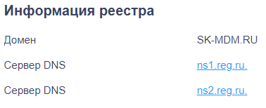
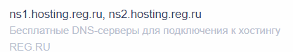
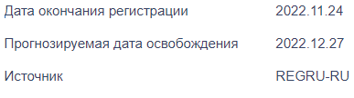
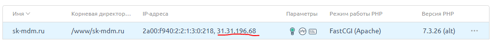
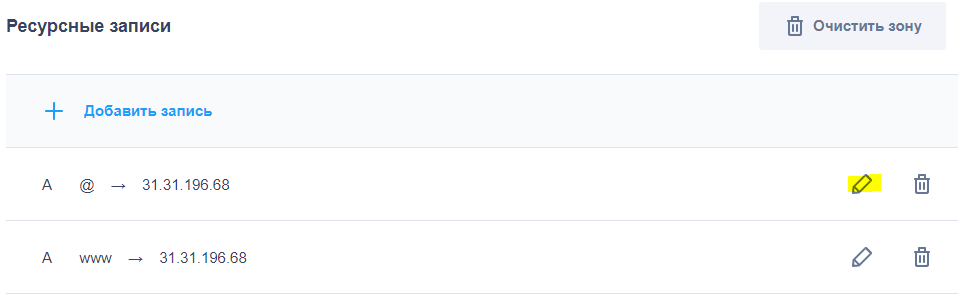
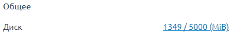

# Переезд

для начала нужно проверить что есть у этого домена.
Можно это сделать практически на любой платформе с помощью инструмента хуиз

## DNS

далее нам предоставится список всего, что есть:

- если DNS-серверы выглядят как:

 

это значит, что управлять ими можно из личного кабинета данного хоста

- а если выглядят как:

это значит, что ими можно управлять из файлов ispmanager

### Также важно проверить дату окончания регистрации и источник

## IP

### способ 1
После того как ты перейдешь в ispmanager и создашь домен - проверь сходится ли ip
адрес с тем, что на хостинге

в случае несостыковки жми на перо и редактируй соответственно ip ispmanagerа

### ИЛИ способ 2

чтобы не ждать вечность переходи по пути 

        C:\Windows\System32\drivers\etc

и добавляй запись по примеру (в конец файла):

        ip.ip.ipi.ip     test-te.ru

чтобы проверить изменился ли ip переходи в cmd и пиши:

        ping test-te.ru

этот способ, в отличие от первого должен действовать мнгновенно, поэтому, если не сработало - пересохроняй или редактируй в другом браузере

НО второй способ работает только на твоем компе

## проверка скока весит и влезят ли чемоданы в газель

для того, чтобы узнать сколько весит сайт необходимо:

- в ispmanager прописать команду

        mc

- откроется винтажный редактор, в котором необходимо перейти в созданный домен
- далее прописать команду 

        du -sh
- для вывода с сортировкой от большего к меньшему

        du | sort -n -r 
        
- для большего функционала гуглить linux du command
- и узнать скока он весит
- далее узнать скока есть места на домене на вкладке Главное

в случае несостыковочки - писать менеджеру

## проверить ссылки на 301 редирект

    https://4web.su/s_redirect/

## Перенаправление с HTTP на HTTPS через файл .htaccess

    https://reddock.ru/help/articles/511-522-524-783--perenapravlenie-s-http-na-https-i-obratno-cherez-fajl-htaccess/

## Анализ внешних и внутренних ссылок

    https://pr-cy.ru/link_extractor/

## анализ sitemap

    https://site-analyzer.ru/
